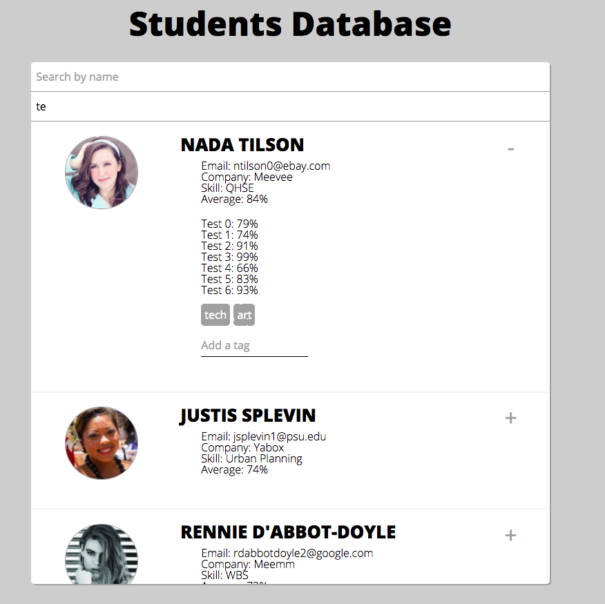

# Student Profiles

Frontend app allowing user to browse student database & add tags for students.

## Features

1. Student data is fetched using a fake API call using `json-server`.
2. Data is displayed and styled on the client using React components & CSS.
3. Client has the the ability to see individual grades and add tags in the expandable list view.
4. Client can filter on students based on their name and tags.

## Frontend Components

App was built using functional React components powered by React Hooks.

- App
  - Search
  - StudentList
    - ExpandedDetails
